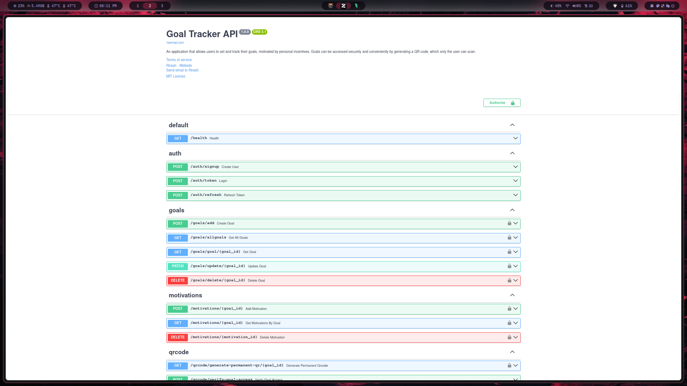
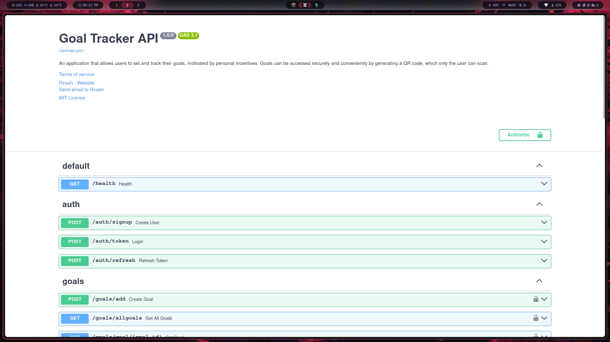
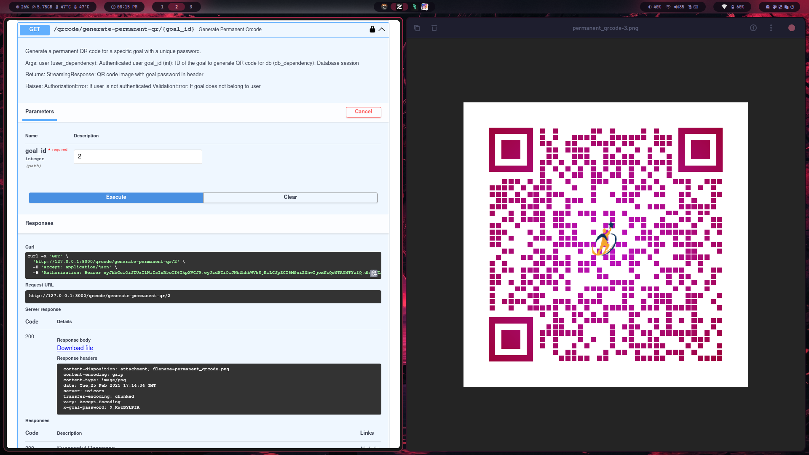

# 🏆 SataPlan: Your Personal Goal Tracking Companion

## 🌟 Project Overview

SataPlan is a cutting-edge personal development platform designed to transform how you set, track, and achieve your goals. More than just a goal-tracking app, it's a motivational ecosystem that combines technology, psychology, and user-centric design.


## 🚀 Key Features

### 🎯 Intelligent Goal Management
- Create, update, and track goals with ease
- Personalized goal setting with descriptive details
- Comprehensive goal lifecycle management

### 💡 Motivational Ecosystem
- Add inspiring quotes and links to each goal
- Maintain a personal motivation database
- Stay inspired and focused on your objectives

### 🔐 Secure Access Mechanism
- OAuth2 JWT-based authentication
- QR Code-based goal access
- One-time use tokens for enhanced security

### 🔎 Smart Search Functionality
- Live search across goals and motivations
- Quick and intuitive navigation

## 🖼 Application Screenshots

### Dashboard Overview


### Goal Creation Interface


### QR Code Access


*Note: Screenshots showcase the intuitive user interface and key features of SataPlan*

## 🛠 Tech Stack

### Backend
- **Framework**: FastAPI
- **Database**: SQLite (Extensible to PostgreSQL)
- **Authentication**: OAuth2 JWT
- **Language**: Python 3.10+

### Frontend
- **Framework**: Next.js
- **State Management**: TBD
- **Styling**: TBD

## 🚦 API Endpoints

### Authentication
- User registration
- Login
- Token management

### Goal Management
- Create goals
- Retrieve goals
- Update goals
- Delete goals

### Motivation Management
- Add motivational quotes
- Retrieve motivations
- Delete motivations

### QR Code Access
- Generate permanent QR codes
- Verify goal access
- View goals via QR

## 🔑 Security Features

- JWT Token Authentication
- One-time use QR tokens
- Secure password hashing
- Role-based access control

## 🛠 Local Development Setup

### Prerequisites
- Python 3.10+
- uv (Python package manager)
- Git

### Installation Steps
```bash
# Clone the repository
git clone https://github.com/Mohamed-Rirash/sataplan.git
cd sataplan/backend

# Create virtual environment
uv venv

# Activate virtual environment
source .venv/bin/activate

# Install dependencies
uv sync

# Generate secret key
python -c "import secrets; print(secrets.token_hex(32))"

# Create .env file with generated key and configurations
# Add necessary environment variables

# Start the development server
fastapi dev
```

## 🔒 Environment Configuration

Create a `.env` file with:
```
AUTH_SECRET_KEY=your_generated_secret_key
ALGORITHM=HS256
QR_CODE_URL=http://localhost:5173/private
CORS_ALLOW_ORIGINS=http://localhost:5173
DATABASE_URL=sqlite:///db.sqlite
```

## 🚀 Deployment

### Recommended Deployment Platforms
- Vercel
- Heroku
- AWS Elastic Beanstalk
- DigitalOcean App Platform

## 🤝 Contributing

1. Fork the repository
2. Create your feature branch
3. Commit your changes
4. Push to the branch
5. Create a Pull Request

## 📜 License

MIT License

## 🌍 Contact

**Maintainer**: Mohamed Rirash
**GitHub**: [Mohamed-Rirash](https://github.com/Mohamed-Rirash)

## 🙏 Acknowledgements

- FastAPI Community
- Python Open Source Ecosystem
- Inspiration from personal productivity tools
`
create venv
```bash
uv venv
```
activate venv
```bash
source .venv/bin/activate
```
add dependencies
```bash
uv sync
```

Start the server

```bash
fastapi dev
```

Open the Swagger UI:

[http://localhost:8000/api/docs](http://localhost:8000/api/docs)

### 🖼 Screenshots


### 🏗 Tech Stack

- Backend: FastAPI, PostgreSQL
- Authentication: OAuth2 JWT Tokens
- QR Code: QR Code Generator
- frontend: next.js

### 📜 License

MIT

### 🤝 Contact & Support

For any issues, feel free to open an issue on GitHub or contact the maintainer.
